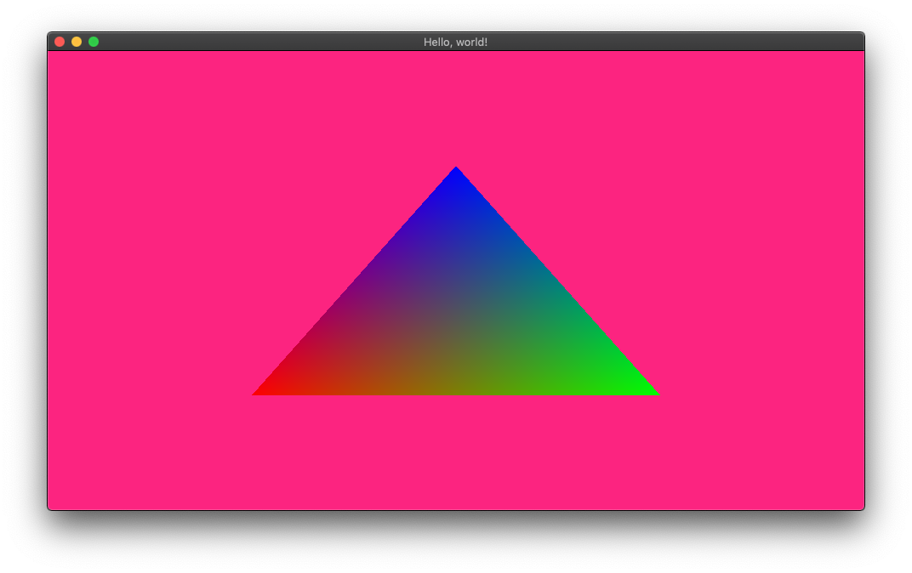

# Rendering our triangle

A [`RenderGate`] allows to create _render nodes_. Such nodes will share [`RenderState`]s for all
lower nodes in the graphics pipeline. We will see what we can do with [`RenderState`] in a future
chapter. Currently, we will just use the default one.

```rust
use luminance::render_state::RenderState;
```

And alter your pipeline:

```rust
surface.pipeline_builder().pipeline(&back_buffer, color, |_, mut shd_gate| {
  shd_gate.shade(&program, |_, mut rdr_gate| {
    rdr_gate.render(RenderState::default(), |mut tess_gate| {
      // …
    });
  });
});
```

We’re almost there. We’re getting a [`TessGate`], allowing us to render actual tessellations. In
order to do so, we will need to create a [`TessSlice`] out of our [`Tess`]. That enables to slice
GPU tessellation on the fly fro free. In our case, we want the whole thing (the whole triangle),
so we will use the [`..`] operator.

> You will need the [`TessSliceIndex`] trait to do such a thing.

```rust
use luminance::tess::{Mode, TessBuilder, TessSliceIndex as _};
```

Let’s go and finish it.

```rust
surface.pipeline_builder().pipeline(&back_buffer, color, |_, mut shd_gate| {
  shd_gate.shade(&program, |_, mut rdr_gate| {
    rdr_gate.render(RenderState::default(), |mut tess_gate| {
      tess_gate.render(triangle.slice(..));
    });
  });
});
```

Compile and run the code. You should see something similar to this:



The complete code:

```rust
use luminance::context::GraphicsContext as _;
use luminance::render_state::RenderState;
use luminance::shader::program::Program;
use luminance::tess::{Mode, TessBuilder, TessSliceIndex as _};
use luminance_derive::{Semantics, Vertex};
use luminance_glfw::{Action, GlfwSurface, Key, Surface as _, WindowDim, WindowEvent, WindowOpt};
use std::process::exit;
use std::time::Instant;

#[derive(Copy, Clone, Debug, Semantics)]
pub enum VertexSemantics {
  #[sem(name = "position", repr = "[f32; 2]", wrapper = "VertexPosition")]
  Position,
  #[sem(name = "color", repr = "[u8; 3]", wrapper = "VertexRGB")]
  Color
}

#[derive(Vertex)]
#[vertex(sem = "VertexSemantics")]
pub struct Vertex {
  position: VertexPosition,
  #[vertex(normalized = "true")]
  color: VertexRGB
}

const VERTICES: [Vertex; 3] = [
  Vertex { position: VertexPosition::new([-0.5, -0.5]), color: VertexRGB::new([255,   0,   0]) },
  Vertex { position: VertexPosition::new([ 0.5, -0.5]), color: VertexRGB::new([  0, 255,   0]) },
  Vertex { position: VertexPosition::new([  0.,  0.5]), color: VertexRGB::new([  0,   0, 255]) },
];

const VS_STR: &str = include_str!("vs.glsl");
const FS_STR: &str = include_str!("fs.glsl");

fn main() {
  let surface = GlfwSurface::new(WindowDim::Windowed(960, 540), "Hello, world!", WindowOpt::default());

  match surface {
    Ok(surface) => {
      eprintln!("graphics surface created");
      main_loop(surface);
    }

    Err(e) => {
      eprintln!("cannot create graphics surface:\n{}", e);
      exit(1);
    }
  }
}

fn main_loop(mut surface: GlfwSurface) {
  let start_t = Instant::now();

  let back_buffer = surface.back_buffer().unwrap();

  let triangle = TessBuilder::new(&mut surface)
    .add_vertices(VERTICES)
    .set_mode(Mode::Triangle)
    .build()
    .unwrap();

  let program: Program<VertexSemantics, (), ()> = Program::from_strings(None, VS_STR, None, FS_STR)
    .unwrap()
    .ignore_warnings();

  'app: loop {
    // handle events
    for event in surface.poll_events() {
      match event {
        WindowEvent::Close | WindowEvent::Key(Key::Escape, _, Action::Release, _) => break 'app,
        _ => ()
      }
    }

    // rendering code goes here
    // get the current time and create a color based on the time
    let t = start_t.elapsed().as_millis() as f32 * 1e-3;
    let color = [t.cos(), t.sin(), 0.5, 1.];

    surface.pipeline_builder().pipeline(&back_buffer, color, |_, mut shd_gate| {
      shd_gate.shade(&program, |_, mut rdr_gate| {
        rdr_gate.render(RenderState::default(), |mut tess_gate| {
          tess_gate.render(triangle.slice(..));
        });
      });
    });

    // swap buffer chains
    surface.swap_buffers();
  }
}
```

[luminance]: https://crates.io/crates/luminance
[luminance-derive]: https://crates.io/crates/luminance-derive
[`Vertex`]: https://docs.rs/luminance/latest/luminance/vertex/trait.Vertex.html
[`Semantics`]: https://docs.rs/luminance/latest/luminance/vertex/trait.Semantics.html
[`Copy`]: https://doc.rust-lang.org/std/marker/trait.Copy.html
[`Clone`]: https://doc.rust-lang.org/std/clone/trait.Clone.html
[`Debug`]: https://doc.rust-lang.org/std/fmt/trait.Debug.html
[`VertexAttrib`]: https://docs.rs/luminance/latest/luminance/vertex/trait.VertexAttrib.html
[`HasSemantics`]: https://docs.rs/luminance/latest/luminance/vertex/trait.HasSemantics.html
[`Tess`]: https://docs.rs/luminance/latest/luminance/tess/struct.Tess.html
[`TessBuilder`]: https://docs.rs/luminance/latest/luminance/tess/struct.TessBuilder.html
[`Mode`]: https://docs.rs/luminance/latest/luminance/tess/enum.Mode.html
[`Mode::Point`]: https://docs.rs/luminance/latest/luminance/tess/enum.Mode.html#variant.Point
[`Pipeline`]: https://docs.rs/luminance/latest/luminance/pipeline/struct.Pipeline.html
[`ShadingGate`]: https://docs.rs/luminance/latest/luminance/pipeline/struct.ShadingGate.html
[GLSL]: https://www.khronos.org/opengl/wiki/Core_Language_(GLSL)
[`TessellationControlShader`]: https://docs.rs/luminance/latest/luminance/shader/stage/enum.Type.html#variant.TessellationControlShader
[`TessellationEvaluationShader`]: https://docs.rs/luminance/latest/luminance/shader/stage/enum.Type.html#variant.TessellationEvaluationShader
[`VertexShader`]: https://docs.rs/luminance/latest/luminance/shader/stage/enum.Type.html#variant.VertexShader
[`GeometryShader`]: https://docs.rs/luminance/latest/luminance/shader/stage/enum.Type.html#variant.GeometryShader
[`FragmentShader`]: https://docs.rs/luminance/latest/luminance/shader/stage/enum.Type.html#variant.FragmentShader
[`Program`]: https://docs.rs/luminance/latest/luminance/shader/program/struct.Program.html
[`BuiltProgram`]: https://docs.rs/luminance/latest/luminance/shader/program/struct.BuiltProgram.html
[turbofish syntax]: https://doc.rust-lang.org/1.30.0/book/first-edition/generics.html
[`RenderGate`]: https://docs.rs/luminance/latest/luminance/pipeline/struct.RenderGate.html
[`RenderState`]: https://docs.rs/luminance/latest/luminance/render_state/struct.RenderState.html
[`TessGate`]: https://docs.rs/luminance/latest/luminance/pipeline/struct.TessGate.html
[`TessSlice`]: https://docs.rs/luminance/latest/luminance/tess/struct.TessSlice.html
[`TessSliceIndex`]: https://docs.rs/luminance/latest/luminance/tess/struct.TessSliceIndex.html
