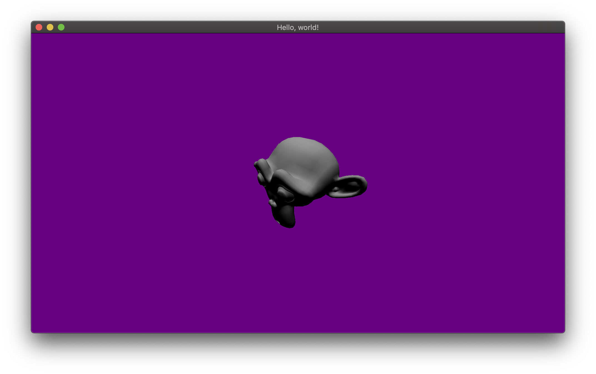

# Wavefront .obj loader

In the previous chapter, we saw how to render a single triangle by using several concepts:

- [`Vertex`] and [`Semantics`] types to define what vertices can be.
- [`Mode`], [`Tess`] and its [`TessBuilder`] companion type to build GPU tessellations.
- [`VertexShader`], [`FragmentShader`] and [`Program`] to create shaders.
- [`Pipeline`], [`ShadingGate`], [`RenderGate`] and [`TessGate`] to create graphics pipelines.

In this chapter, we will see how we can write a [Wavefront .obj] viewer.

[`Vertex`]: https://docs.rs/luminance/latest/luminance/vertex/trait.Vertex.html
[`Semantics`]: https://docs.rs/luminance/latest/luminance/vertex/trait.Semantics.html
[`Tess`]: https://docs.rs/luminance/latest/luminance/tess/struct.Tess.html
[`TessBuilder`]: https://docs.rs/luminance/latest/luminance/tess/struct.TessBuilder.html
[`Mode`]: https://docs.rs/luminance/latest/luminance/tess/enum.Mode.html
[`Pipeline`]: https://docs.rs/luminance/latest/luminance/pipeline/struct.Pipeline.html
[`ShadingGate`]: https://docs.rs/luminance/latest/luminance/pipeline/struct.ShadingGate.html
[`ShadingGate::shade`]: https://docs.rs/luminance/latest/luminance/pipeline/struct.ShadingGate.html#method.shade
[`VertexShader`]: https://docs.rs/luminance/latest/luminance/shader/stage/enum.Type.html#variant.VertexShader
[`FragmentShader`]: https://docs.rs/luminance/latest/luminance/shader/stage/enum.Type.html#variant.FragmentShader
[`Program`]: https://docs.rs/luminance/latest/luminance/shader/program/struct.Program.html
[`RenderGate`]: https://docs.rs/luminance/latest/luminance/pipeline/struct.RenderGate.html
[`TessGate`]: https://docs.rs/luminance/latest/luminance/pipeline/struct.TessGate.html
[Wavefront .obj]: https://en.wikipedia.org/wiki/Wavefront_.obj_file
